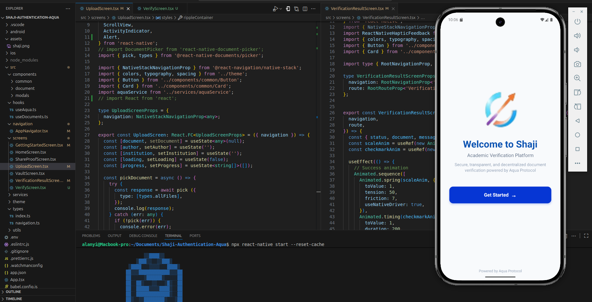
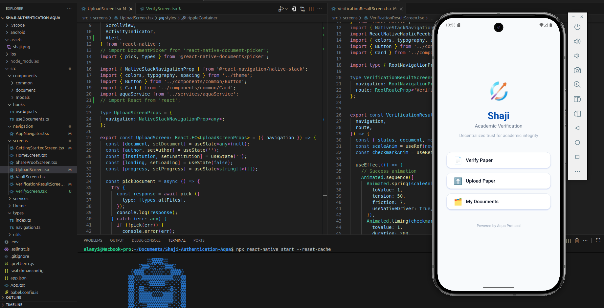

# Getting Started
This is a type script project for the Eth Safari Hackathon 2025, The project is for the Aqua track and it runs on the Aqua sdk

1. clone the project, 
2. unzip it, 
3.```npm install ```

## React Doctor
npx react-native doctor

## Step 1: Start Metro
npx react-native start --reset-cache

## Step 2: Build and run your Android app

cd android
./gradlew clean
cd ..
npx react-native start --reset-cache

npx react-native run-android

# You must see something like this Splash Screen 



# First Screen 



